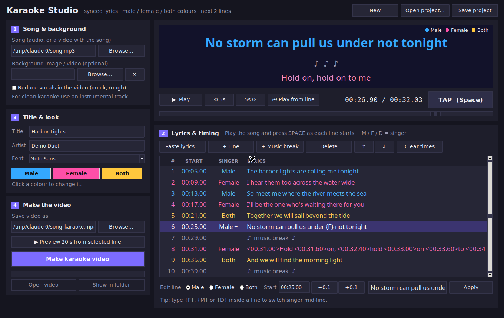

<p align="center"></p>

# Karaoke Studio

A Windows desktop app (Python + Tkinter + ffmpeg) for making karaoke videos with lyrics synced to the song — built for Indian-language songs (Tamil, Hindi, Telugu, Kannada, Malayalam and more) as well as English.

- Word-by-word colour wipe: **blue = male, pink = female, gold = both**, including singer switches mid-line
- Current line plus the **next two lines** always on screen
- Get the song's audio and cover image from a **YouTube link**, or use your own audio/video file
- **✨ Auto-sync** lyrics to the song on your own PC (Whisper forced alignment via stable-ts), or tap along with Space, or open an existing synced `.lrc` / `.srt`
- 1080p MP4 output ready for YouTube




Turns a timed lyrics file + a song's audio into a 1080p MP4 ready for YouTube:

- Words wipe from white to the singer's colour in sync with the music
- **Blue = Male, Pink = Female, Gold = Both** (colours editable at the top of `karaoke.py`)
- Current line + **the next 2 lines** always on screen, tinted by who sings them
- Singer can change mid-line, e.g. call-and-response
- Title card, 3-2-1 countdown dots, and a colour legend

## Karaoke Studio app (easiest way)

1. **One-time setup:** double-click **`Setup.bat`**. It installs pygame, ffmpeg and the YouTube downloader (yt-dlp + Deno) and puts a **Karaoke Studio** shortcut on your Desktop.
2. **Open Karaoke Studio** from the Desktop (to recreate the shortcut with its icon any time, double-click `Create Desktop Shortcut.bat`) (or double-click `Karaoke Studio.bat`).
3. **① Song:** paste a **YouTube link** and click **Get** (or right-click the box to paste). The app saves the song as an mp3 and the video's thumbnail as the cover image in the `songs` folder, fills in the title, and loads both. Finished videos go to the `videos` folder.
   Or click *Browse…* to use a song file you already have (mp3, wav, m4a, or a video like mp4), and optionally a cover picture or background video. *Blur the cover image* keeps text on thumbnails from clashing with the lyrics.
4. **② Lyrics:** click *Paste lyrics…*, paste the song (one line per lyric line), choose who sings untagged lines, then *Replace all lines*.
5. **Sync the lyrics** — three ways:
   - **Already-synced file:** if your lyrics file has times (`[00:12.34] …` — a synced `.lrc`, or an `.srt`), click **Open lyrics file…**. The times are kept, including word-level `<00:12.34>` times. Just set the singers.
   - **✨ Auto-sync** (plain lyrics): click **✨ Auto-sync**. The app listens to the song and times every line *and every word*. It picks the language from your lyrics (Tamil, Hindi, Telugu, Kannada, Malayalam, Bengali, Marathi, Gujarati, Punjabi, Urdu, English); choose *Better* accuracy and keep *Separate the singing from the music* ticked. First run it once: **`Setup AutoSync.bat`** (one-time, ~2–3 GB download; models are kept in the `models` folder). Afterwards, press Play and fix any line that's off.
   - **Tap by hand:** see below.
   **Tap to sync:** click the first line, press **Play**, and press **SPACE** the moment each line starts — the next line is selected automatically. Press **M / F / D** to set a line's singer (you can do this while it plays). Use the *−0.1 / +0.1* buttons next to Start to fine-tune, and *Play from line* to re-check a section. To switch singer mid-line, edit the line and type `{F}`, `{M}` or `{D}` where the switch happens.
6. **③ Title & look:** title, artist, font (Nirmala UI covers all Indian scripts) and the three colours.
7. **④ Make the video:** *Preview 20 s* renders a quick clip from the selected line; **Make karaoke video** renders the full MP4 with a progress bar. Your lyrics + timing are saved as a `.lrc` project next to the video — reopen it any time with *Open project…*.

If a YouTube link stops working (YouTube changes often), run `Setup.bat` again — it updates the downloader. Only download videos you're allowed to use; karaoke uploads of commercial songs are best kept Private or Unlisted.

Keyboard: `Space` tap · `M` `F` `D` singer · `P` play/pause · `←` `→` seek 2 s · `Delete` remove line · `Ctrl+S` save.

The rest of this README covers the command-line version (`karaoke.py`), which the app uses under the hood.

## 1. Install (one time)

- **Python 3.8+** — python.org
- **ffmpeg** — with Anaconda (Windows): open *Anaconda Prompt* and run `conda install -c conda-forge ffmpeg`.
  Otherwise Windows: `winget install ffmpeg` · Mac: `brew install ffmpeg` · Linux: `sudo apt install ffmpeg`

## 2. Write the lyrics file

Plain text, one line per lyric, saved as `something.lrc` (UTF-8):

```
title: Song Title
artist: Artist Name

[00:12.50] M: A line the man sings
[00:16.20] F: A line the woman sings
[00:20.00] D: A line they sing together
[00:24.00] M: He starts this line {F} and she finishes it
[00:28.00]
[00:35.10] F: <00:35.10>Exact <00:35.60>word <00:36.40>timing <00:37.00>here
```

| Syntax | Meaning |
|---|---|
| `[mm:ss.xx]` | When the line starts being sung |
| `M:` / `F:` / `D:` | Male / Female / Both. If omitted, the previous singer continues |
| `{M}` `{F}` `{D}` | Switch singer in the middle of a line |
| `[mm:ss.xx]` with no text | The previous line ends here (use before instrumental breaks) |
| `<mm:ss.xx>` before a word | Optional exact word start — otherwise words are spread evenly across the line |
| `# ...` | Comment, ignored |

Standard `.lrc` files you already have work too — just add `M:`/`F:`/`D:` tags.

**Getting timestamps:** play the song in any player that shows hundredths of a second (VLC, Audacity), or use an LRC tap-sync tool, and note when each line starts. Line timing alone looks good; add `<word>` stamps only for lines where the wipe feels off.

## Indian-language songs

Works with Tamil, Hindi, Telugu, Kannada, Malayalam, Bengali, Marathi, Gujarati, Punjabi, Odia and more — even mixed with English in one song.

- **Save the `.lrc` as UTF-8.** In Notepad: *Save As → Encoding: UTF-8*. Otherwise the letters come out as `????`.
- **Font:** on Windows the default is **Nirmala UI**, which covers every major Indian script. To try another installed font:
  `python karaoke.py song.lrc --audio song.mp3 --font "Latha" -o out.mp4`
  (Other Windows fonts: Latha — Tamil, Mangal — Hindi/Marathi, Gautami — Telugu, Tunga — Kannada, Kartika — Malayalam, Vrinda — Bengali. Free Google "Noto Sans Tamil / Devanagari / …" fonts also work once installed.)
- The highlight moves **word by word** (words are split on spaces). Add `<mm:ss.xx>` stamps before words in lines with long held notes.
- Want a romanised (English-letter) version too? Write the transliteration as the line text instead — e.g. `[00:12.50] M: kadal kaatru veesuthu` — or make two videos from two `.lrc` files.
- Don't change `Spacing` in the style lines inside `karaoke.py` — any letter spacing breaks how Indian-script letters join.

## 3. Make the video

```
python karaoke.py mysong.lrc --audio instrumental.mp3 -o mysong_karaoke.mp4
```

Options:
- `--bg photo.jpg` or `--bg loop.mp4` — background image or looping video (auto-darkened so lyrics stay readable)
- `--preview 30` — render only the first 30 s to check timing quickly
- `--ass-only -o mysong.ass` — just the subtitle file (open in Aegisub to fine-tune timing visually)

Use an **instrumental / vocal-removed** track for real karaoke. Tools like Ultimate Vocal Remover (free) split a song into vocals and instrumental.

## 4. Upload to YouTube

The output (H.264 1080p30, AAC 192k, faststart) matches YouTube's recommended settings — upload as-is. Note that commercial songs are usually detected by Content ID even for personal uploads; setting the video to **Private** or **Unlisted** keeps it just for you.

## Customising

Edit the block at the top of `karaoke.py`: `SINGER_COLORS`, `FONT`, `CUR_SIZE`/`NEXT_SIZE`, `SLOT_Y` (line positions), `PREVIEW_ALPHA` (brightness of upcoming lines), `DEFAULT_BG`.
